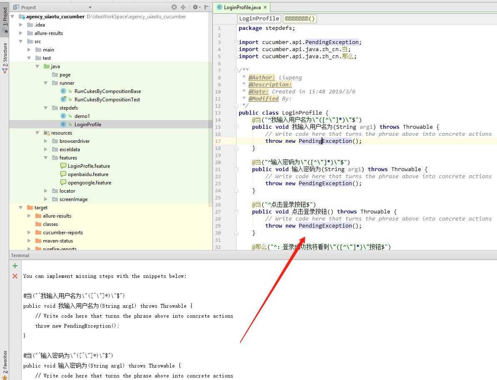
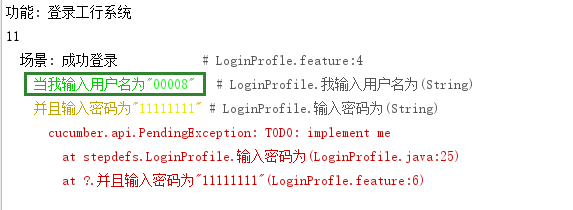

# 自动化测试规范文档
本文描述自动化只用框架以及规范
## 新建项目
在开发一个新项目时，从gitlab上将项目模板拉下来
* 项目地址
```
git@git.cdecube.com:test/cucumber_selenium_object.git
```
* 项目结构
```
├─main
│  ├─java
│  └─resources
└─test
    ├─java
    │  ├─page
    │  ├─runner
    │  └─stepdefs
    └─resources
        ├─browserdriver
        ├─exceldata
        ├─features
        ├─locator
        └─screenImage
```
### 结构解析
* 所有脚本都将在test目录下进行开发

|目录|解释|
|---|---|
|page-->|封装一个模块或者功能的页面操作|
|runner-->|用例执行器，主要使用@CucumberOptions注解配置报告输出以及用例的调度，Tag的使用请查阅第一部分[cucumber](http://pan.cdecube.com/d/364d704142bc491fa6dd/)的配置|
|stepdefs-->|所有case将在此目录下开发|
|browserdriver-->|存放各浏览器的驱动，并定期更新|
|exceldata-->|存放数据驱动的文档数据|
|features-->|存放行为驱动用例，features的使用请查阅第一部分[cucumber](http://pan.cdecube.com/d/364d704142bc491fa6dd/)的配置|
|locator-->|存放所有脚本的元素不可以在业务代码中出现定位元素|
|screenImage-->|存放所有异常截图|

### 引入seleniumapi
* seleniumapi采用数据驱动、分层结构、元素分离，高内聚低耦合的设计模式并封装了各类通用的方法，是目前自动化框架的核心部件。
将gitlab上源码拉下来或者，下载jar包，在maven中引入本地jar包
* 项目地址
```
git@git.cdecube.com:test/seleniumapi.git
```
* 目录结构
```
├─main
│  ├─java
│  │  └─com
│  │      └─cdecube
│  │          └─agency
│  │              └─common
│  └─resources
└─test
    ├─java
    └─resources
        ├─browserdriver
        ├─exceldata
        ├─locator
        └─screenImage
```
### Class类分析
|目录|解释|
|---|---|
|BaseTest|case基类，所有case继承该类，根据场景不同可以重写beforclass，afterclass方法|
|DotTestListener|监听类，自动监听Assert断言，如果失败自动截图，可在xml中配置全局监听|
|ExcelData|解析excel|
|Log|log4j|
|Page|解析yaml并封装Webdriver所有方法，以及其他第三方方法|
|Preset|前置条件类，构造driver|
|ScreenShot|封装截图方法|
|selectDriver|driver工厂，所有driver必须出自于此，否则会空指针|
|tool|常用工具类|

* 主要方法解析

>[com.cdecube.agency.common](http://git.test.cdecube.com/liupeng/agencyEpc/tree/develop/src/main/java/com/cdecube/agency/common)

>>[DotTestListener](http://git.test.cdecube.com/liupeng/agencyEpc/tree/develop/src/main/java/com/cdecube/agency/common/DotTestListener.java "监听类")<br>

>>>[onTestFailuregit](# "-->*重写onTestFailure方法如果用例执行失败，就调用takeScreenshot截图*")<br>

>>[ExcelData](http://git.test.cdecube.com/liupeng/agencyEpc/tree/develop/src/main/java/com/cdecube/agency/common/ExcelData.java "读取Excle方法（数据驱动）") <br>
>>[Page](http://git.test.cdecube.com/liupeng/agencyEpc/tree/develop/src/main/java/com/cdecube/agency/common/Page.java "通用API封装类")<br>

>>>[getYamFile](# "-->*读取yaml文件*")<br>
>>>[getBy](# "-->*枚举各by方法*")<br>
>>>[watiForElement](# "-->*显示等待方法*")<br>
>>>[getElement](# "-->*获取单个元素方法*")<br>
>>>[getElements](# "-->*获取一组元素方法*")<br>
>>>[waitgetElement](# "-->*获取单个元素等待方法（调用显示等待方法，可自由传入需要等待的时间）*")<br>
>>>[areaGetElements](# "-->*获取固定区域下的一组元素*")<br>

>>>[addCookies](# "-->*封装addCookie方法，绕过复杂验证码登录*")<br>
>>>[moveElement](# "-->*封装action动作,模拟鼠标移动到元素上*")<br>
>>>[getUrl](# "-->*获取Url*")<br>
>>>[isDisplay](# "-->*判断元素是否存在*")<br>
>>>[sleep](# "-->*封装Thread.sleep方法*")<br>

>>[Preset](http://git.test.cdecube.com/liupeng/agencyEpc/tree/develop/src/main/java/com/cdecube/agency/common/Preset.java "前置条件封装类")<br>

>>>[getDriver](http://git.test.cdecube.com/liupeng/agencyEpc "获取driver的静态方法")<br>
>>>[timeout](# "隐式等待方法")<br>
>>>[maxwind](# "窗口最大化")<br>
>>>[quit](# "退出浏览器")<br>


>>[ScreenShot](http://git.test.cdecube.com/liupeng/agencyEpc/tree/develop/src/main/java/com/cdecube/agency/common/ScreenShot.java "封装截图方法")<br>
>>[selectDriver](http://git.test.cdecube.com/liupeng/agencyEpc/tree/develop/src/main/java/com/cdecube/agency/common/selectDriver.java "Driver选择器封装类")<br>
>>[tool](http://git.test.cdecube.com/liupeng/agencyEpc/tree/develop/src/main/java/com/cdecube/agency/common/tool.java "常用工具封装类")<br>

>[com.cdecube.agency](http://git.test.cdecube.com/liupeng/agencyEpc/tree/develop/src/test/java/com/cdecube/agency)
>>[action](http://git.test.cdecube.com/liupeng/agencyEpc/tree/develop/src/test/java/com/cdecube/agency/action "对一些用例进行封装") <br>
>>[po](http://git.test.cdecube.com/liupeng/agencyEpc/tree/develop/src/test/java/com/cdecube/agency/po "po模式") <br>
>>[test](http://git.test.cdecube.com/liupeng/agencyEpc/tree/develop/src/test/java/com/cdecube/agency/test "作为调试的地方") <br>
>>[testcase](http://git.test.cdecube.com/liupeng/agencyEpc/tree/develop/src/test/java/com/cdecube/agency/testcase "存放用例的地方") <br>

>[resources](http://git.test.cdecube.com/liupeng/agencyEpc/tree/develop/src/test/resources "allure配置文件") <br>

>[pom.xml](# "pom配置文件")<br>
>[testng.xml](# "case配置文件")<br>
>[locator](http://git.test.cdecube.com/liupeng/agencyEpc/tree/develop/src/locator "yaml文件")<br>


# BDD脚本开发流程
## features伪代码编写
* 新建feature文件
  保存文件后缀名为feature
  
```
  LoginProfle.feature
```
将language设置为中文，以中文关键字编写feature,场景大纲加例子可以作为数据驱动的模式传入数据
  
```
  # language: zh-CN
  功能：登录工行系统
    场景：成功登录
    当我输入用户名为"00008"
    并且输入密码为"11111111"
    并且点击登录按钮
    那么：登录成功我将看到"退出"按钮
      场景大纲: 输入账户密码进行登录
        当我输入用户名为"<username>"
        并且输入密码为"<password>"
        那么我将看到提示消息为"<message>"
        例子:
          | username | password | message |
          | 000009 | 11111111 | "用户名或密码错误" |
          | 000008 | 111111111 | "用户名或密码错误" |
          | | 11111111 | "请输入用户名" |
          | 000008 | | "请输入密码" |
```
 ## 生成脚本
 点击右键运行feature文件，或者控制台输入命令
 
```
 mvn test
```
 将生成的代码复制到脚本中
 
 
 此时，feature里的用例便于脚本中的方法进行关联，在feature中安装Ctrl+步骤可以直接跳转至脚本中对应的方法
 * 运行feature，将输出undefined stup告诉我们脚本没有定义，所有feature执行是失败的，下一步我们只需在脚本中填充对应的方法即可，这也是BDD模式最核心的一点：先测试再编码。
```
Undefined step: 当 我输入用户名为"00008"
```
## 填充脚本
 按照生成的脚本，我们将其中的方法补充,在编码之前我们需要先改造一下生成的脚本。
 * 首先是继承seleniumapi中的BaseTest，该方法中包含了测试的前置与结束之后要做的事情。

**之前：**
```java
@当("^我输入用户名为\"([^\"]*)\"$")
public void 我输入用户名为(String arg1) throws Throwable {
    // Write code here that turns the phrase above into concrete actions
    throw new PendingException();
}
```
**之后：**
```java
@当("^我输入用户名为\"([^\"]*)\"$")
public void 我输入用户名为(String arg1) throws Throwable {
    page.getElement("用户输入框").sendKeys(arg1);
}
```
在运行feature时便可以看到该步骤变为绿色通过


## 编写Page
在编码过程中，使用po模式，即脚本与步骤分离，在一个page页面中预先编写好该页面或功能所有的元素方法操作方法，在编写case时直接引用，可提高代码复用性。
```java
public class loginPage {
    WebDriver driver;
    public void setup() {
        System.setProperty("webdriver.chrome.driver","src/test/resources/browserdriver/chromedriver.exe");
        driver = new ChromeDriver();
        driver.manage().window().maximize();
    }
    public void getUrl(String args1) {
        setup();
        driver.get(args1);
    }
    public String getLoginUrl() {
        String geturl = driver.getCurrentUrl();
        return geturl;
    }
    public String getTitle() {
        String gettitle = driver.findElement(By.xpath("(//div[@class=\"title\"])[1]")).getText();
        return gettitle;
    }
    public void inputUsername(String arg1) {
        driver.findElement(By.xpath("//input[@type=\"text\"]")).sendKeys(arg1);
    }
    public void inputPassword(String arg1) {
        driver.findElement(By.xpath("//input[@type=\"password\"]")).sendKeys(arg1);
    }
    public void clickLoginButton() {
        driver.findElement(By.xpath("//button")).click();
    }
    public boolean getLoginout(String arg1) {
        String a;
        a = driver.findElement(By.xpath("//span[@class=\"logout__1zHYTpZ\"]")).getText();
        if (a.equals(arg1)){
            return true;
        }else {
            return false;
        }
    }
    public String getErroMessage() {
        String erromessage;
        erromessage = driver.findElement(By.xpath("//div[@class='error-box']")).getText();
        return erromessage;
    }
    public void close() {
        driver.close();
    }
    public void scrren() {
        ScreenShot screenShot = new ScreenShot(driver);
        screenShot.takeScreenshot("com.lp","screen");
    }
}
```
脚本中直接调用
```java
public class StepDefinitions2 {
    private loginPage loginPage ;

    @当("^我打开网站URL \"([^\"]*)\"$")
    public void 我打开网站url(String arg1) throws Throwable {
        loginPage = new loginPage();
        loginPage.getUrl(arg1);
    }

    @那么("^进入登录页面$")
    public void 进入登录页面() throws Throwable {
        Assert.assertEquals("http://gonghang.test.cdecube.com/signin",loginPage.getLoginUrl());
    }

    @当("^我输入用户名为\"([^\"]*)\"$")
    public void 我输入用户名为(String arg1) throws Throwable {
        loginPage.inputUsername(arg1);
    }

    @当("^输入密码为\"([^\"]*)\"$")
    public void 输入密码为(String arg1) throws Throwable {
        loginPage.inputPassword(arg1);
        loginPage.clickLoginButton();
    }

    @那么("^我能看到URL变为\"([^\"]*)\"$")
    public void 我能看到url变为(String arg1) throws Throwable {
        Thread.sleep(2000);
        Assert.assertEquals(arg1,loginPage.getLoginUrl());
    }

    @那么("^可以看到\"([^\"]*)\"按钮$")
    public void 可以看到_按钮(String arg1) throws Throwable {
        Assert.assertEquals(loginPage.getLoginout(arg1),true);
    }

    @当("^点击登录按钮$")
    public void 点击登录按钮() throws Throwable {
        loginPage.clickLoginButton();
    }

    @那么("^我将看到验证失败的提示\"([^\"]*)\"用户名或密码错误\"([^\"]*)\"$")
    public void 我将看到验证失败的提示_用户名或密码错误(String arg1, String arg2) throws Throwable {
        Thread.sleep(2000);
        Assert.assertEquals("用户密码错误",loginPage.getErroMessage());
    }

    @那么("^我将看到验证失败的提示\"([^\"]*)\"请输入用户名\"([^\"]*)\"$")
    public void 我将看到验证失败的提示_请输入用户名(String arg1, String arg2) throws Throwable {
        Assert.assertEquals("请输入用户名",loginPage.getErroMessage());

    }

    @那么("^我将看到验证失败的提示\"([^\"]*)\"请输入密码\"([^\"]*)\"$")
    public void 我将看到验证失败的提示_请输入密码(String arg1, String arg2) throws Throwable {
        Assert.assertEquals("请输入密码",loginPage.getErroMessage());

    }
    @那么("^可以看到\"([^\"]*)\"标题$")
    public void 可以看到_标题(String arg1) throws Throwable {

        Assert.assertEquals(arg1,loginPage.getTitle());
    }

    @那么("^开始截图并保存$")
    public void 开始截图并保存() throws Throwable {
        loginPage.scrren();
    }
    @After
    public void f() {
        loginPage.close();
    }
    @那么("^退出浏览器$")
    public void 退出浏览器() throws Throwable {
        loginPage.close();
    }

}
```
## 编写Action
同样的，为了保证代码模块的复用性，我们可以将一个通用的功能或者业务模块，封装成一个action，在case中直接引用即可
